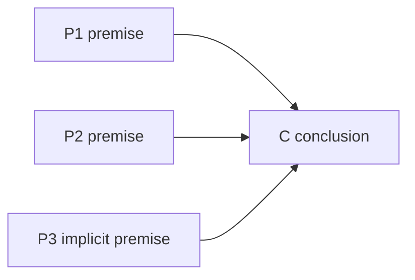

# Logic

Turn loose claims into testable arguments. Default output is an argument analysis, not an article. Build an article outline only when the user explicitly asks for an article, post, or essay.

Full fallacy catalog and valid forms: [REFERENCE.md](REFERENCE.md). Worked examples: [EXAMPLES.md](EXAMPLES.md).

## 1. Extract the thesis

Restate the central claim in one sentence. If there are two claims, split them and analyze each separately. Do not proceed with a compound thesis.

## 2. Map premises and conclusion

List premises as P1, P2, ... and the conclusion as C. Mark indicator words such as because, since, given that for premises and therefore, hence, in consequence for conclusions. If a premise is implicit, label it `[implicit]` and state it plainly.

## 3. Classify the reasoning

Ask which standard the argument must meet:

- **Deductive:** general to particular. If premises are true and form is valid, the conclusion must be true. Test with valid forms in [REFERENCE.md](REFERENCE.md).
- **Inductive:** particular observations to generalization. Conclusion is probable, never certain. Ask for sample size, representativeness, and counterexamples.
- **Abductive:** observed fact to best explanation. List at least two rival explanations and compare simplicity, scope, and fit with evidence.

State the verdict as valid/invalid for deductive, or strong/weak for inductive and abductive, with one reason why.

## 4. Check fallacies and clarity

Run this checklist before accepting any argument:

- [ ] No formal fallacy such as affirming the consequent or denying the antecedent
- [ ] No informal fallacy such as ad hominem, straw man, false cause, appeal to authority
- [ ] Key terms have one stable meaning across premises
- [ ] No hidden premise doing the real work
- [ ] Conclusion does not exceed what premises support

If a check fails, name the problem, quote the offending part, and propose a repair. Details live in [REFERENCE.md](REFERENCE.md).

## 5. Article outline, only on request

Build this section only when the user asks for an article, post, or essay. Otherwise stop after section 4.

1. Thesis and why it matters.
2. Strongest supporting argument in P1/P2/C form.
3. Strongest objection stated fairly, plus reply.
4. Implications and limits.
5. Closing restatement without new claims.

See structures in [EXAMPLES.md](EXAMPLES.md).
