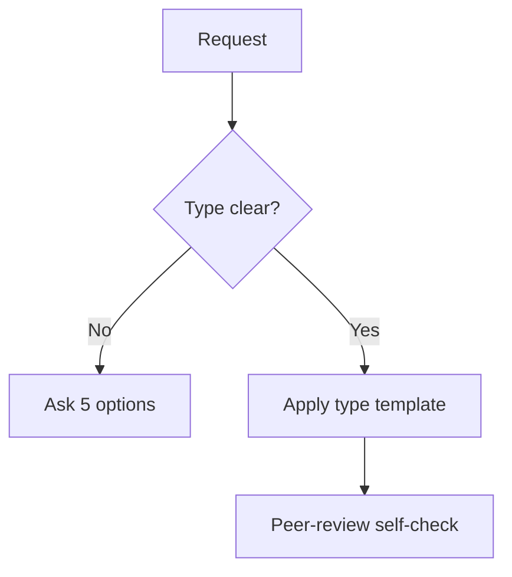

# Paper Craft

Shape a draft into a document the relevant community accepts. Default behavior is to diagnose the document type and enforce its expected form, not to invent claims or data.

For argument validity inside the paper, use the `logic` skill. This skill owns document structure, completeness, citation form, and peer-review readiness.

Full templates per type: [REFERENCE.md](REFERENCE.md). Skeletons: [EXAMPLES.md](EXAMPLES.md).

## 1. Detect the document type

Classify the request into exactly one type before doing anything else:

- **Research article:** reports original data or analysis. Expects IMRaD.
- **Systematic review:** synthesizes existing studies with a protocol. Expects PRISMA.
- **Philosophy essay:** defends a thesis with reasons, objections, and replies.
- **Humanities paper:** advances an interpretation with stakes and literature.
- **Opinion op-ed:** persuades a broad audience in 500-800 words.

If the type is ambiguous, ask one question with these five options and wait. Do not mix templates.

## 2. Apply the type template

Load only the matching section from [REFERENCE.md](REFERENCE.md):

- Research article goes to section 1.
- Systematic review goes to section 2.
- Philosophy essay goes to section 3.
- Humanities paper goes to section 4.
- Opinion op-ed goes to section 5.

Enforce required sections in order. Flag every missing or misplaced section by name. Never silently rename a section to hide a gap.

## 3. Fix abstract, citations, and form

- Abstract mirrors the body: objective, methods or approach, key result or claim, takeaway. Target 150-300 words for research, shorter for essays and op-eds.
- Keywords 4-6, aligned with title and indexing vocabulary where one exists.
- Citations match the declared style: APA 7 author-date for sciences and social sciences, Chicago Notes-Bibliography footnotes for humanities and philosophy, Chicago author-date for interdisciplinary work. Every in-text citation has a reference entry and vice versa. Include DOIs where available. Exclude retracted works.
- Tables and figures are numbered, captioned, and referenced from the text. Captions go above tables and beneath figures.

## 4. Peer-review self-check

Run this checklist before declaring the draft done:

- [ ] Question or thesis is stated once, prominently, and answered at the end
- [ ] Method or approach is replicable from the text
- [ ] Results present data without interpretation, discussion interprets without new data
- [ ] Limitations are stated plainly with impact on the claim
- [ ] Each strong claim traces to evidence or cited source
- [ ] Ethics, consent, and conflicts are declared where applicable
- [ ] No new argument appears in the conclusion

If a check fails, name the section, quote the gap, and propose the repair. See [EXAMPLES.md](EXAMPLES.md) for target shapes.
