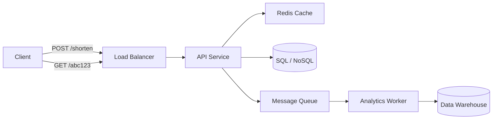
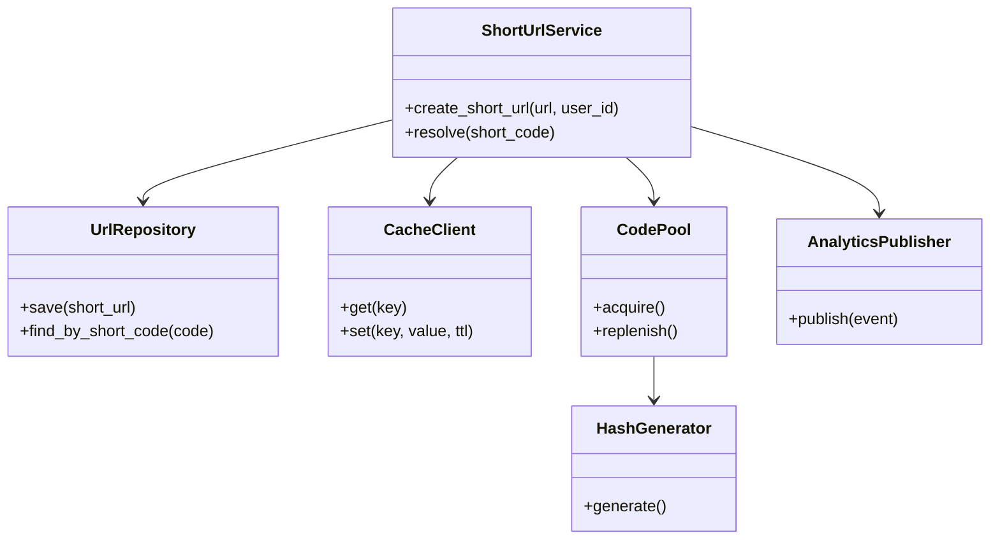

# Example: URL Shortener

A walkthrough of the two-phase workflow applied to a production URL shortener.

---

## Phase A: Software Architecture

### Requirements

**Functional**

- Given a long URL, return a short URL.
- Given a short URL, redirect to the original URL.
- Optionally: custom aliases, expiration, analytics.

**Non-functional**

- High read-to-write ratio (100:1).
- Low latency on redirects (< 50 ms p95).
- High availability (99.99%).
- URLs must not collide.
- Global deployment.

### Constraints and Assumptions

- 100 million new URLs per month.
- 10 billion redirects per month.
- Average URL length: 500 bytes.
- Read-heavy workload.
- Links live for 2 years on average.

### Quality Attributes

1. Availability
2. Latency
3. Scalability
4. Durability
5. Cost efficiency

### Back-of-the-Envelope Estimation

- New URLs: ~40/s average, ~400/s peak.
- Redirects: ~4,000/s average, ~40,000/s peak.
- Storage: 100M × 500 B = 50 GB/month, ~1.2 TB over 2 years.
- Cache hit ratio target: 95%+.

### Architectural Style

**Load-balanced API + cache + database + asynchronous analytics.**

A monolith or small set of services is sufficient; microservices add operational
complexity without clear benefit at this scale.

### Components and Data Flow



### Data Model

**Short URL entity**

| Field | Type | Notes |
|---|---|---|
| short_code | string (PK) | base62 encoded, 7 chars |
| original_url | string | indexed |
| created_at | timestamp | TTL index for expiration |
| user_id | string | optional |

**Read strategy:** cache short_code → original_url.
**Write strategy:** pre-generate short codes to avoid collisions under load.

### Resilience Checklist

- [x] **Redundancy:** database primary + replicas across zones.
- [x] **Failover:** automatic replica promotion.
- [x] **Circuit breaker:** on analytics queue and data warehouse.
- [x] **Retry with backoff + jitter:** on transient cache/db failures.
- [x] **Timeouts:** cache < 5 ms, DB < 50 ms.
- [x] **Rate limiting:** per-IP and per-user quotas.
- [x] **Load balancing:** round-robin across API nodes.
- [x] **Caching:** Redis with TTL and cache-aside strategy.
- [x] **Idempotency:** same long URL + user returns same short code.
- [x] **Graceful degradation:** if cache fails, read from DB directly.
- [x] **Observability:** p95 latency, cache hit ratio, error rate, queue depth.
- [x] **Backups:** daily snapshots, point-in-time recovery.

### Technology Decisions

| Concern | Option A | Option B | Recommendation |
|---|---|---|---|
| Database | PostgreSQL | DynamoDB | PostgreSQL for strong consistency and mature ops |
| Cache | Redis | Memcached | Redis for persistence and TTL |
| Queue | Kafka | RabbitMQ | RabbitMQ for simpler operational model |
| Hashing | base62(MD5) | base62(murmur3) | base62(murmur3) for speed and low collision |

### ADR: Pre-generated Short Codes

- **Context:** generating codes on write risks collisions and hot spots.
- **Decision:** maintain a pool of pre-generated, unique short codes.
- **Consequences:** writes are fast and collision-free; pool must be monitored.

---

## Gate

> Architecture is ready. Do you want to adjust anything before we move to
> Software Design (component breakdown, design patterns, and code skeletons)?
> Reply `proceed` or tell me what to change.

---

## Phase B: Software Design

### Component Decomposition

- `ShortUrlService` — orchestrates shortening and resolution.
- `UrlRepository` — persistence abstraction.
- `CacheClient` — cache abstraction.
- `HashGenerator` — generates unique short codes.
- `CodePool` — manages pre-generated codes.
- `AnalyticsPublisher` — emits analytics events.
- `RateLimiter` — enforces usage quotas.

### Interfaces and Contracts

**REST API**

```
POST /api/v1/shorten
Request:  { "url": "https://example.com/...", "custom_alias": "optional" }
Response: { "short_url": "https://short.io/abc123", "expires_at": "..." }

GET /abc123
Response: 302 redirect to original URL
```

**Internal events**

```json
{
  "event": "url.redirected",
  "short_code": "abc123",
  "timestamp": "2026-01-01T00:00:00Z",
  "country": "MX"
}
```

### Design Patterns

- **Repository** — abstract DB/cache interactions.
- **Factory** — create `ShortUrl` entities.
- **Strategy** — pluggable hash generators.
- **Circuit Breaker** — protect analytics publisher.
- **Outbox** — reliably publish analytics events.

### Class Diagram



### Code Skeleton

```python
from dataclasses import dataclass
from typing import Protocol
from result import Result, Ok, Err


@dataclass(frozen=True)
class ShortUrl:
    short_code: str
    original_url: str
    created_at: str


class UrlRepository(Protocol):
    async def save(self, short_url: ShortUrl) -> Result[None, Error]: ...
    async def find_by_short_code(self, code: str) -> Result[ShortUrl | None, Error]: ...


class CacheClient(Protocol):
    async def get(self, key: str) -> Result[str | None, Error]: ...
    async def set(self, key: str, value: str, ttl_seconds: int) -> Result[None, Error]: ...


class HashGenerator(Protocol):
    def generate(self) -> str: ...


class CodePool:
    def __init__(self, generator: HashGenerator, min_size: int = 1000):
        self._generator = generator
        self._min_size = min_size
        self._codes: list[str] = []

    async def acquire(self) -> Result[str, Error]:
        ...

    async def replenish(self) -> None:
        ...


class ShortUrlService:
    def __init__(
        self,
        repository: UrlRepository,
        cache: CacheClient,
        code_pool: CodePool,
        base_url: str,
    ):
        self._repository = repository
        self._cache = cache
        self._code_pool = code_pool
        self._base_url = base_url

    async def create_short_url(
        self, original_url: str, user_id: str | None = None
    ) -> Result[ShortUrl, Error]:
        ...

    async def resolve(self, short_code: str) -> Result[str, Error]:
        ...
```

### Test Strategy

- **Unit:** `HashGenerator`, `CodePool`, URL validation logic.
- **Integration:** repository + cache round trips.
- **Contract:** API request/response schemas.
- **Load:** redirect p95 latency under 10k RPS.
- **Chaos:** kill a Redis node, verify fallback to DB.
