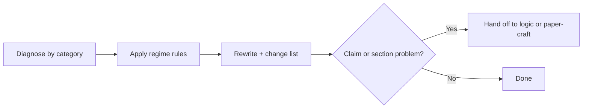

# Prose

Polish sentences and paragraphs without changing claims or document structure. Claim validity belongs to the `logic` skill. Section structure belongs to the `paper-craft` skill. This skill owns voice, precision, concision, rhythm, and cohesion.

Regime details and repair catalog: [REFERENCE.md](REFERENCE.md). Before and after pairs: [EXAMPLES.md](EXAMPLES.md).

## 1. Diagnose before rewriting

Read the passage and label each problem by category. Report the diagnosis first, rewrite after:

- **Voice:** personal vs impersonal, emotive vs neutral.
- **Precision:** vague adjectives, unhedged absolutes, undefined terms.
- **Concision:** pleonasms, stacked subordinates, repeated ideas.
- **Rhythm:** monotonous length, no breathing points, overlong sentences.
- **Cohesion:** missing or repeated connectors, abrupt jumps between paragraphs.

## 2. Apply the regime rules

Detect one regime for the passage. Full rules live in [REFERENCE.md](REFERENCE.md):

- **Academic:** impersonal voice where the venue expects it, neutral adjectives backed by data, hedge verbs for claims without direct evidence, sentences over 30-35 words split in two.
- **Explanatory:** warmer voice allowed, technical terms defined on first use, no arcane jargon without conceptual payoff.
- **Opinion:** first person and stance allowed, but adjectives stay evidence-based and the best counter gets a fair sentence.

Shared rules: one paragraph carries one idea opened by a strong first sentence, connectors vary by logical function, each claim keeps its original strength unless the user asks to strengthen or weaken it.

## 3. Rewrite with a change list

Deliver the polished version followed by a short list grouped by category, for example Voice, Concision, Cohesion. Quote nothing at length, name each fix in one line.

If the diagnosis finds a validity fallacy or a missing document section, name it and hand off instead of masking it with style. Do not let polish hide a broken argument or a gap in structure.
