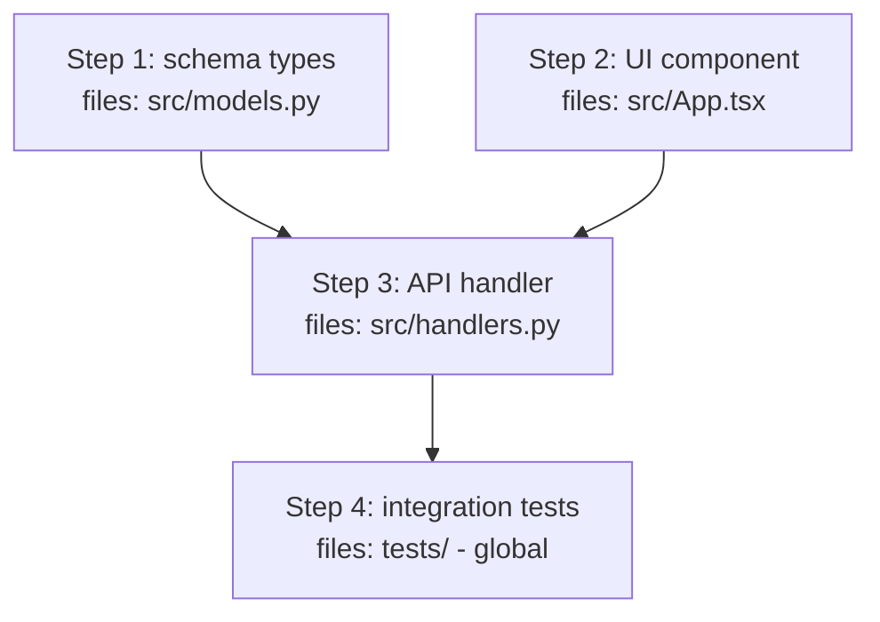

# Plan: <feature-slug>

<!-- Skeleton for docs/plan-<slug>.md.
Replace every <placeholder>.
Delete sections marked (conditional) when they do not apply.
Delete every HTML comment, including this one, from the final plan. -->

> Generated: <YYYY-MM-DD> | Base commit: <output of `git rev-parse --short HEAD`> | DAG: v1
> State file: `docs/plan-<slug>-state.md` - the live runtime record. This plan file stays frozen; all barrier merges, DAG mutations, retry evidence, and counter verdicts append to the state file.

## Required skills

Files the executing agent must READ at session start.
List file paths, not skill names: some skills set `disable-model-invocation: true`, which blocks the Skill tool, so the agent must Read the files directly.

| Skill | Path | Why |
|-------|------|-----|
| <name> | .agents/skills/<name>/SKILL.md | <why the executor needs it> |

---

## Docs for Humans

<!-- Include Mermaid diagrams for structural/sequential concepts,
per the Diagrams section in PRD-TEMPLATE.md. -->

### Problem Statement

### Solution

### User Stories

1. As an <actor>, I want a <feature>, so that <benefit>

### Implementation Decisions

### Testing Decisions

### Out of Scope

### Further Notes

---

## Agent Instructions

> This section is for the agent executing the implementation.
> Read the skill files listed above before starting.

### Context to load first

- Skill files listed above
- Files to be modified (read-only for the coordinator; only lanes edit)
- Key types and interfaces
- Existing tests as style and pattern reference

**Coordinator is read-only on source code:**

- The coordinator NEVER runs Edit or Write on source files, NEVER runs fix commands itself, NEVER performs browser clicks itself.
- The only file the coordinator writes is `docs/plan-<slug>-state.md` during barrier merges plus the DAG log.
- All code changes, test runs for fixes, and browser interactions happen inside lanes or counter subagents.

**Do NOT:**

- Modify files outside those listed (coordinator: do not modify any source file at all)
- Refactor unrelated code
- Assume conventions that are not present in the codebase
- Execute an Implementation step directly instead of spawning a lane subagent (except the trivial single-step exception below)

### If an instruction cannot be executed as written

Detailed instructions are brittle, and the codebase may have moved past the plan's base commit (see header).
The coordinator owns recovery, but never mutates without diagnosing first.
Iron law: no DAG mutation and no fix wave without a Fault Localization Report.

1. Log the mismatch in the state file (expected vs actual, files involved).
2. If the mismatch is trivial (e.g. a slightly different file path), adapt, continue, and note it in the state file.
3. Otherwise write the Fault Localization Report (see section below), record reason + DAG diff + affected waves, and continue.
4. Only stop and ask when guardrails, evals, and counter review all fail to produce a safe path.
5. Every stop-and-ask must attach the Fault Localization Report.
6. Never improvise silently without logging.
7. Never ask a bare `proceed to next wave or fix this one` question without the report.

### Project commands

<!-- Author: verify these by running them against package.json, pyproject.toml, or Makefile, and fill in the project's actual commands.
Do not assume a stack: this repo has both a TypeScript frontend and a Python backend. -->

| Purpose | Command |
|---------|---------|
| Typecheck | <e.g. `make -C source typecheck` or `npx tsc --noEmit`> |
| Tests | <e.g. `make -C source test` or `npx vitest run`> |
| Lint | <e.g. `make -C source lint` or `npm run lint`> |
| Dev server (only if browser validation applies) | <e.g. `npm run dev`> |

### Execution strategy

| Strategy | Value |
|----------|-------|
| Mode | sequential | parallel |
| Max parallelism | <N workers, default 3> |
| Isolation | shared-branch | worktree-per-worker |

> Waves always exist. Sequential means `Max parallelism: 1` (one lane at a time), not direct execution by the coordinator. Fill every section below; do not leave placeholders. Exception: a trivial single-step single-file plan may run directly without lanes, but must state why delegation overhead is not justified.

### Dependency graph

<!-- Required for all plans. Leaf nodes at top. Edges = depends_on. Mark file-conflict edges dashed. Sequential plans use single-lane waves with Max parallelism 1. -->



> DAG version: v1 at plan time. Runtime mutations append v2, v3, ... to the state file DAG log. Never edit this frozen graph; record mutations in the state file.

### DAG log (runtime, in state file)

| Version | Reason | Diff | Affected waves |
|---------|--------|------|----------------|
| v1 | Initial plan | - | All |
| <v2> | <e.g. Step 3 split after API surface grew> | <moved Step 3b to Wave 2b> | <Wave 2> |

### File conflict matrix

| File | Wave 1 | Wave 2 | Wave 3 | Conflict? |
|------|--------|--------|--------|-----------|
| <e.g. src/models.py> | Step 1 | - | - | No - isolated |
| <e.g. src/App.tsx> | Step 2 | - | - | No - isolated |
| <e.g. src/handlers.py> | - | Step 3 | - | - |

> No two parallel steps may touch the same file. If they do, sequentialize into sub-waves or split the file. Verify with `grep` on the Files column.

### Waves (always, even when sequential)

| Wave | Steps | Parallelizable | Depends on | Sub-agent assignment | Barrier guardrail |
|------|-------|----------------|------------|----------------------|-------------------|
| 1 | 1, 2 | yes (2 lanes) | - | `general` for Step 1, `explore` for Step 2 | `typecheck` both lanes green |
| 2 | 3 | no | Wave 1 | `general` | `tests` pass |
| 3 | 4 | yes (N lanes) | Wave 2 | `general x2` | `integration + lint` |

> Each lane is one `subagent` tool call with `background:true`. The coordinator runs the barrier protocol before starting the next wave: merge lane outputs into the state file, run barrier guardrails, spawn Tier 1 counter review, then proceed or replan. See Coordinator protocol and Context to load per wave.

### Context to load per wave

<!-- Every wave gets minimal context per lane: its wave's files + key types + one example test. Shared context merges at barriers. Sequential waves use one lane with Max parallelism 1. -->

- Wave 1 Lane A (Step 1): `<files>`, `<key types>`, `<example test>`, skills: `<skill IDs, e.g. good-python>`
- Wave 1 Lane B (Step 2): `<files>`, `<key types>`, `<example test>`, skills: `<skill IDs or none>`
- Shared after Wave 1 barrier: `<integration tests, shared types>`

### Lane kickoff gate (Load phase for all lanes, GO phase for editing lanes)

Two-phase start. Phase 1: skill load + readiness (every lane, including `explore` and `counter` reviews). Phase 2: GO (editing lanes only). A lane must not edit any file before receiving GO.

The coordinator spawns each editing lane with this prompt shape:

```
Goal: Implement Plan: `docs/plan-<slug>.md`, Wave <N> Lane <X> (Steps <...>)
Role: Senior Software Engineer

Read the plan file section, wave spec, and state file section listed in Context to load per wave before writing any code. Confirm we share the same understanding first.

Reply with exactly:
1. Summary (2-3 lines): the real problem and the main goal for this lane.
2. Skills to load: skill IDs from Required skills you will load via the skill tool (e.g. `Load the skill with id `good-python` using the skill tool.`), or `none`. After loading, read REFERENCE.md and EVALS.md from the reported skill base directory, EXAMPLES.md as support, and list what you loaded.
3. Critical points and edge cases you detect.
4. Confirmation that you are ready to start. Do not edit any file yet.
```

The coordinator spawns each review lane (`counter`, `explore`) with this prompt shape:

```
Goal: Review Plan: `docs/plan-<slug>.md`, <Wave N diff | full branch diff>
Role: Senior Software Engineer

Step 1: Load every applicable language skill from Required skills via the skill tool (one `Load the skill with id X using the skill tool.` call per ID), then read REFERENCE.md and EVALS.md from each reported skill base directory. List skill IDs plus supporting files read as loading evidence.
Step 2: Reply with exactly:
1. Summary (2-3 lines) of what is under review.
2. Loading evidence from Step 1, or `none` with reason when no language skill applies.
3. Critical points and edge cases you detect.
A verdict or finding without loading evidence is invalid.
```

Rules:

- Load skills via the skill tool, never by `Read` alone. `Read` on a SKILL.md path does not register a session load and hides supporting files. Fallback to direct `Read` of SKILL.md plus REFERENCE.md, EXAMPLES.md, and EVALS.md only when the skill tool denies access; log the fallback in the reply.
- One readiness round only. If the summary is wrong, the coordinator corrects scope and re-spawns or aborts the lane; do not debate across rounds.
- Allowed files are limited to the Files column for this lane. Anything else is out of scope.
- After readiness passes, the coordinator replies with explicit `GO` to editing lanes. Only then may the lane start the retry loop. Review lanes proceed to findings once loading evidence is accepted; there is no GO for read-only work.
- Only the trivial single-step exception skips this gate, and must log why delegation overhead is not justified.

### Coordinator protocol

Barrier order is fixed. The coordinator is the only writer at barriers and NEVER implements steps itself:

1. Collect lane outputs (files touched, commands run, eval results).
2. Merge into `docs/plan-<slug>-state.md` per-wave sections. Lanes never merge shared context themselves.
3. Run barrier guardrails + wave evals (read-only checks like `git diff`, test output review).
4. Spawn Tier 1 counter review (blocking). On `fail`, write the Fault Localization Report before any DAG mutation.
5. Decide: proceed to next wave, replan on new DAG version, or stop and ask with the report attached if no safe path exists.

| Coordinator may | Coordinator must NOT |
|-----------------|----------------------|
| Read any file, run `git diff` / `git status` | Run Edit or Write on source files |
| Spawn lane and `counter` subagents | Implement a step directly (except trivial single-step exception) |
| Merge lane outputs into the state file | Merge code or resolve conflicts by hand |
| Run read-only guardrail checks at barriers | Run fix commands or browser clicks itself |

Every Implementation step runs inside exactly one lane subagent, even when `Max parallelism` is 1. No step is ownerless.

### Fault Localization Report (blocking before any replan or stop-and-ask)

Trigger: lane retry loop exhausted (2 fix attempts), Tier 1 `fail`, or any barrier guardrail failure.
The coordinator writes exactly one report per failure, using this strict template.
Copy it into the state file and into any stop-and-ask message.

```
Fault Localization Report - Wave <N>
Layer: P1 Problem | P2 Solution | P3 Plan/Spec | P4 Agent | P5 Other (confidence: high/medium/low)
Evidence: <validator output + file paths with line numbers, e.g. src/handlers.py:42>
Root cause vs symptom (1 line): <what is broken vs what merely looks broken>
Recommended action (1 line): <respawn lane | minimal DAG mutation | clarify problem | suggest plan-critique-loop>
Critique suggestion: <only for P2/P3: `Run plan-critique-loop on docs/plan-<slug>.md` | otherwise: no critique needed>
```

Conditional workflow:

1. Failure occurred? Write the report first, mutate second.
2. Layer is P4 or P5? Apply the minimal DAG mutation or respawn the lane. State `no critique needed`. Continue.
3. Layer is P2 or P3? Suggest plan-critique-loop on `docs/plan-<slug>.md`. Never auto-run it. Wait for user approval or apply the minimal unblocking mutation and note the pending critique.
4. Layer is P1? Stop and ask for problem clarification. No mutation until the user confirms.
5. Same wave failed 3 times, or Tier 1 failed twice with identical findings? Reclassify one layer up (P4 -> P3 -> P2 -> P1) and stop and ask with the report attached. Do not replan the same layer again.

### State file

One Markdown file per plan: `docs/plan-<slug>-state.md`. Initialized at DAG v1 with one section per wave plus counter slots and DAG log. Per-wave section records inputs, files touched, key type surface, commands with output summary, eval results, retry count, and Tier 1 verdict. Every failure also appends one Fault Localization Report with layer, confidence, evidence, and recommended action. The final gate section records Tier 2a, 2b, 2c verdicts plus the fix-cycle count. Append only; never rewrite history.

### Lane retry loop

Each lane runs act -> eval -> reflect -> fix, max 2 fix attempts. Each attempt logs validator output (typecheck, test, lint) into its state file section before retrying. Retries without evidence are not allowed. The third failure isolates the lane until the barrier; other lanes continue and the coordinator decides at the barrier.

### Implementation steps

Each step has a **guardrail**: a verifiable condition that must hold before moving to the next step.
If a guardrail fails, run the lane retry loop (act -> eval -> reflect -> fix, max 2 fix attempts, validator output logged to the state file). On the third failure isolate the lane until the barrier and let the coordinator decide.
`Waves` defines which steps run in which lane and each lane's `subagent` assignment; the coordinator never executes steps itself. Sequential plans use single-lane waves with `Max parallelism: 1`; lane failures isolate until the barrier (see Error budget).

<!-- Example row (delete):
| 1 | Add `carpeta_id` to the Ticket model | source/app/models.py | `make -C source typecheck` reports no new errors |
-->

| # | Step | Files | Guardrail |
|---|------|-------|-----------|
| 1 | <short description> | <files to touch> | <verifiable condition> |
| 2 | ... | ... | ... |

### Evals (Evaluation-Driven Development)

Define the eval before implementing the step.
Each step has one or more evals proving the change works.
Each eval runs inside its lane or after its wave's barrier (lane-local typecheck may run before the barrier).

<!-- Example row (delete):
| 1 | A ticket saved with a carpeta_id reads back with the same carpeta_id | integration | `make -C source test` |
-->

| Step | Eval | Type | Command | Run after |
|------|------|------|---------|-----------|
| 1 | <test description> | unit / integration / e2e | <command> | Wave 1 barrier | 
| 2 | ... | ... | ... | Wave 1 barrier or lane-local |

> `Run after` is `Step N`, `Wave N barrier`, or `global`. Lane-local evals (e.g. `typecheck` per lane) may run before the barrier.

### Counter review (Tier 1 per wave, Tier 2 final gate before merge)

Tier 1 runs after each wave barrier on the wave diff. Tier 2 is the final pre-merge gate on the full branch diff with three parallel lanes: 2a correctness, 2b language standard, 2c 12-factor. All gates are blocking.

The coordinator spawns one `counter` subagent per review with this prompt shape, filled from Docs for Humans and the current diff:

```
@counter review against current git diff
Problem Statement:
<copy Problem Statement from Docs for Humans verbatim>

Solution:
<copy Solution from Docs for Humans verbatim>

Scope: <wave diff for Tier 1, full branch diff for Tier 2>

Before refuting: load every applicable language skill from Required skills via the skill tool (one `Load the skill with id X using the skill tool.` call per ID), then read REFERENCE.md and EVALS.md from each reported skill base directory. Open the review with loading evidence (skill IDs plus supporting files read), or `none` with reason when no language skill applies.
```

Rules:

- Verdict format is `pass / fail + findings`, stored in the state file with file paths and line numbers. A verdict without loading evidence is invalid and the coordinator re-spawns the review.
- Keep the review narrow: refute the diff against the stated problem and solution. No scope redesign; file scope questions as findings.
- Tier 1 `fail` triggers the Fault Localization Report before any DAG mutation. Tier 2 `fail` in any lane blocks the merge until fixed and re-reviewed.

### Tier 2a correctness (final gate)

Same `counter` prompt as above on the full branch diff. Refutes the complete change against Problem Statement and Solution. Blocking.

### Tier 2b language standard (final gate, `counter` type)

One `counter` lane per language touched by the diff, run in parallel. The lane loads the skill via the skill tool; auto-trigger phrases do not apply here. Verified invocation: `Load the skill with id `<skill-id>` using the skill tool.`

| Diff touches | Skill ID | Fallback skill file |
|--------------|----------|---------------------|
| `*.py` | `good-python` | `.agents/skills/good-python/SKILL.md` |
| `*.ts`, `*.tsx` | `good-typescript` | `.agents/skills/good-typescript/SKILL.md` |
| `*.rs` | `rusty` | `.agents/skills/rusty/SKILL.md` |

Lane prompt shape:

```
Load the skill with id `<skill-id>` using the skill tool.
Review this diff against the language skill.
Skill ID: <id from table above, one lane per language>
Diff: <full branch diff>
After loading, read REFERENCE.md and EVALS.md from the reported skill base directory (EXAMPLES.md as support) before writing findings.
```

Rules:

- Loading evidence is required: the lane must cite the skill ID loaded plus supporting files read. A verdict without that evidence is invalid and the coordinator re-spawns the lane.
- Fallback to direct `Read` of SKILL.md plus REFERENCE.md and EVALS.md only when the skill tool denies access; log the fallback in the verdict.

Rules:

- Findings on lines touched by this diff are blocking. Findings on pre-existing code outside the diff are advisory only; log them separately and do not block the merge.
- Verdict `pass / fail + findings` goes to the state file Tier 2b slot with file paths and line numbers.
- If no language above is touched, log `Tier 2b: not applicable - no Python, TypeScript, or Rust in diff` and proceed.

### Tier 2c 12-factor (final gate, conditional, `counter` type)

Required when the plan touches deploy, runtime, config, or backing services. Skipped with a logged reason for pure library changes with no runtime surface. Runs as a `counter` lane.

Checklist (all 12, blocking on diff-touched surface, advisory on pre-existing):

| # | Factor | Gate question |
|---|--------|---------------|
| 1 | Codebase | One repo, one deployable, change tracked in version control |
| 2 | Dependencies | Declared explicitly, no implicit system packages, reproducible install |
| 3 | Config | Config in environment, no secrets hardcoded, sample config updated |
| 4 | Backing services | Services treated as attached resources, URLs and credentials via config |
| 5 | Build, release, run | Build separate from release and run, release immutable and tagged |
| 6 | Processes | Stateless processes, shared state in backing services, sticky sessions avoided |
| 7 | Port binding | Service self-contained, port from environment, no hardcoded ports |
| 8 | Concurrency | Scales via process model, no in-process singletons assumed |
| 9 | Disposability | Fast startup, graceful shutdown, safe to kill and restart |
| 10 | Dev/prod parity | Dev matches prod closely, no dev-only shortcuts in the diff |
| 11 | Logs | Logs to stdout as event stream, no log files written by the app |
| 12 | Admin processes | One-off tasks as versioned scripts, run against the release |

Lane prompt shape:

```
Review this diff against the 12-factor checklist in the plan.
Diff: <full branch diff>
Report one pass/fail per factor with file paths and line numbers.
```

### Tier 2 fix iteration loop

Any `fail` in Tier 2a, 2b, or 2c spawns fix waves as DAG v2+ executed by lanes, never by the coordinator. After fixes, re-run only the failed Tier 2 lanes.

- Max 4 fix cycles for Tier 2. After the fourth failed re-review, stop and ask the user instead of spawning more waves.
- Each cycle appends DAG version, fix summary, and re-review verdicts to the state file. The merge stays blocked until 2a, 2b, and 2c are all `pass` (or logged `not applicable` for 2b/2c with reason).

### Browser validation (conditional: only if the change affects UI)

The coordinator delegates this to a lane subagent. The coordinator itself never drives the browser.

Use the agent's Playwright MCP browser tools: `browser_navigate`, `browser_snapshot`, `browser_click`, `browser_take_screenshot`.
Do NOT use `@playwright/test`.
If the MCP browser tools are not available in the session, report it and skip this section - do not substitute another mechanism.

1. Start the dev server
2. Navigate to the relevant page with `browser_navigate`
3. Check that the expected elements exist with `browser_snapshot`
4. Interact with `browser_click` if applicable
5. Capture evidence with `browser_take_screenshot`

Success criterion:

```
<what the snapshot must show>
```

### Human-in-the-Loop checkpoints

At these points the agent must PAUSE and ask the user before continuing.
Keep it to 1-3 checkpoints: each one interrupts the executor's autonomous flow.
Use wave barriers as checkpoints.

1. **After step <N>:** <what the user must confirm>
2. **After Wave <N> barrier:** <all lanes in wave done, confirm merge or next wave>
3. **Before merge:** <final validation>

### Error budget

Single source of truth for failure tolerance in this plan.
`Scope` distinguishes per-wave isolation from global fail-fast. Sequential waves use per-wave scope with one lane.

| Event | Scope | Limit | Action when exceeded |
|-------|-------|-------|----------------------|
| New or failing test | per-wave / global | 2 fix attempts | For per-wave: isolate lane, others continue to barrier, coordinator decides; for global: run retry loop in a lane then stop and report; never continue or declare done with failing tests |
| Type errors in touched files | per-wave / global | 0 | Isolate lane until barrier, then stop and fix before next wave |
| Pre-existing type errors | global | Not counted | Ignore, they predate the change |
| New lint errors | per-wave / global | 0 | Isolate lane; stop and fix before next wave |
| Browser validation failure | global | 1 retry | Stop, report, and ask |
| File not found | per-wave / global | - | Log in state file, apply smallest DAG mutation, continue; only stop and ask if no safe mutation exists |
| Ambiguous instruction | global | 0 | Stop and ask; never assume |
| Counter review fail (Tier 1) | per-wave | 0 without replan | Write Fault Localization Report, then coordinator replans DAG before next wave |
| Missing Fault Localization Report | global | 0 | Block the replan and the stop-and-ask until the report exists in the state file |
| Same wave fails 3 times or identical Tier 1 fail twice | global | 0 | Reclassify one layer up (P4 -> P3 -> P2 -> P1), stop and ask with report attached |
| Tier 2a correctness fail | global | max 4 fix cycles | Spawn fix waves as DAG v2+, re-review 2a; after 4th failed re-review stop and ask |
| Tier 2b language-standard fail | global | max 4 fix cycles | Findings on diff-touched lines block; pre-existing outside diff is advisory; fix waves then re-review 2b |
| Tier 2c 12-factor fail | global | max 4 fix cycles | Findings on diff-touched surface block; fix waves then re-review 2c |

### Completion checklist

The agent must complete this before declaring the work done:

- [ ] All implementation steps done (all waves and barriers green)
- [ ] New tests pass
- [ ] Existing tests still pass
- [ ] Typecheck passes with no new errors
- [ ] Lint passes
- [ ] Browser validation passed (only if applicable, executed by a lane)
- [ ] No out-of-scope files modified
- [ ] Coordinator made zero direct source edits (all changes via lanes, verifiable in git + state file)
- [ ] Dependency graph and file-conflict matrix filled
- [ ] State file updated at every barrier with lane outputs, eval results, retry evidence, and counter verdicts
- [ ] DAG log current (v1 at plan time, v2+ appended for every runtime mutation)
- [ ] Tier 1 counter review passed for every wave
- [ ] Fault Localization Report written for every wave failure, with P1-P5 layer, confidence, evidence with path:line, and recommended action
- [ ] plan-critique-loop suggested only for P2/P3 failures, never auto-run, with plan path included
- [ ] Tier 2a correctness passed on the full branch diff
- [ ] Tier 2b language standard passed for every touched language (or logged not applicable with reason)
- [ ] Tier 2c 12-factor passed (or logged skipped with reason for pure library changes)
- [ ] Tier 2 fix cycles within budget (max 4), state file holds all verdicts and DAG versions

---

## Risks

| Risk | Mitigation |
|------|-----------|
| <risk> | <mitigation> |
